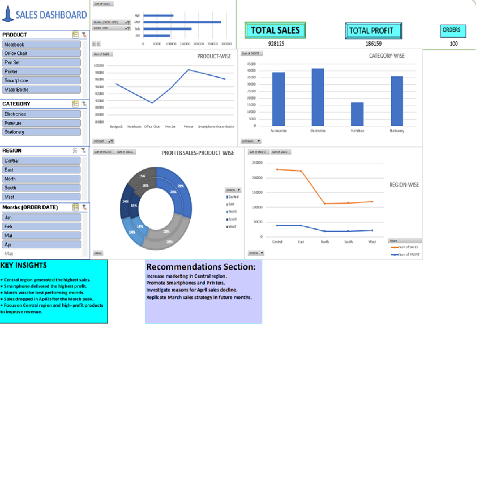

# Sales Performance Dashboard 📊

An interactive Excel dashboard analyzing sales performance across products, categories, regions, and months.

## Dashboard Preview

## Key Features
- 4 Interactive Slicers — Product, Category, Region, Month
- KPI Cards — Total Sales (928,125), Total Profit (186,159), Total Orders (100)
- Product-wise Sales Line Chart
- Category-wise Profit Bar Chart
- Profit & Sales Donut Chart (Region breakdown)
- Region-wise Sales & Profit Line Chart
- Key Insights & Recommendations Section

## Key Insights
- Central region generated the highest sales
- Smartphone delivered the highest profit
- March was the best performing month
- Sales dropped in April after the March peak
- Focus on Central region and high-profit products to improve revenue

## Recommendations
- Increase marketing in Central region
- Promote Smartphones and Printers
- Investigate reasons for April sales decline
- Replicate March sales strategy in future months

## Tools Used
- Microsoft Excel
- Pivot Tables
- Slicers
- Charts — Line, Bar, Donut
